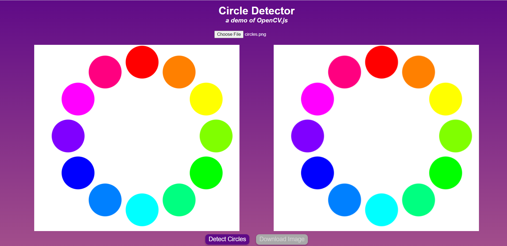
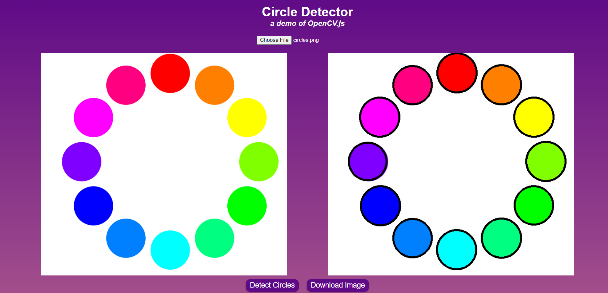
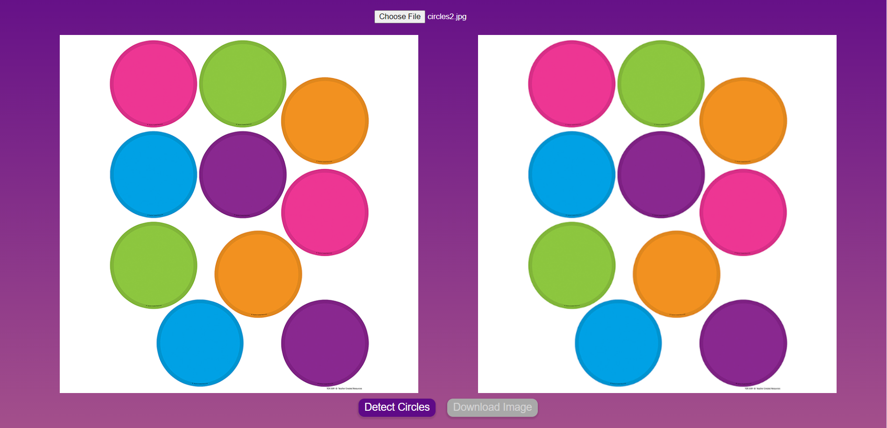
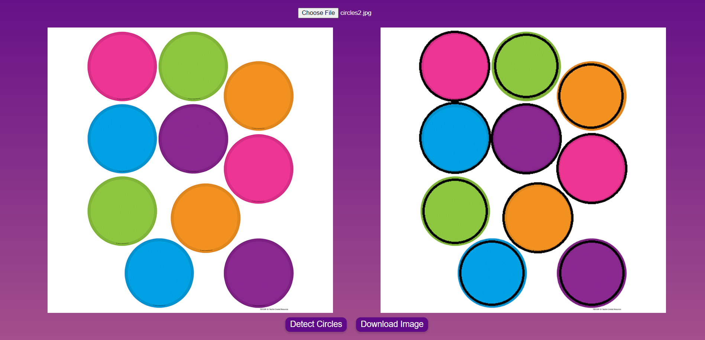

# Computer Vision: OpenCV.js

## What you built? 

I used an open-source JavaScript library called OpenCV to get a better understanding of computer vision. Simultaneously, I also integrated image uploading and downloading.

I built a basic circle detector. A user uploads an image from their computer. The site then detects any circles in the uploaded picture, outlines them, then places a drawn-on image next to the original. The user then has the option to download the new image.

The OpenCV library is what was used for circle detection. First, the provided image is converted to grayscale; this step allows the detection methods to work more efficiently. The grayscale image is then passed to the `HoughCircles` function, alongside parameters for detection method, accumulator resolution, and minimum distance between circles. This function returns the center coordinates and radii of each circle found in the image.

A lot of time was spent researching different Computer Vision modules and deciding which language I wanted to code in. I settled on JavaScript as I felt it would be easiest to integrate with a website or a mobile app. I also believe someone who I would like to work with on the final project has some experience in CV in a different language, so having basic understandings of several different languages will give us more options in the future!

### Screenshots

## Who Did What?

I worked on this project by myself!

## What you learned

I learned the basics of computer vision, which is awesome! It feels a lot like utilizing a pre-trained machine learning model, which makes sense since CV relies so heavily on ML! I also learned image uploading and downloading, which was much simpler than I expected it to be. Lastly, I had a quick refresher on deployment using Netlify - something that may not necessarily be needed for the group project but is good to know!

Overall, everything went relatively well for this tutorial! The only shortcoming I felt was that I only learned how to detect circles. I imagine it will be much more difficult to detect and identify a variety of shapes and sizes of objects, but this certainly feels like a step towards being able to tackle that larger challenge!

## Authors

Quinn Spraut

## Acknowledgments

[An Introduction to Computer Vision in JavaScript using OpenCV.js](https://www.digitalocean.com/community/tutorials/introduction-to-computer-vision-in-javascript-using-opencvjs)
